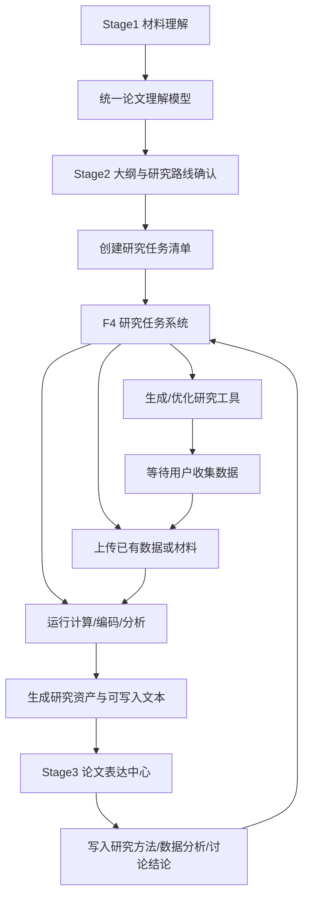
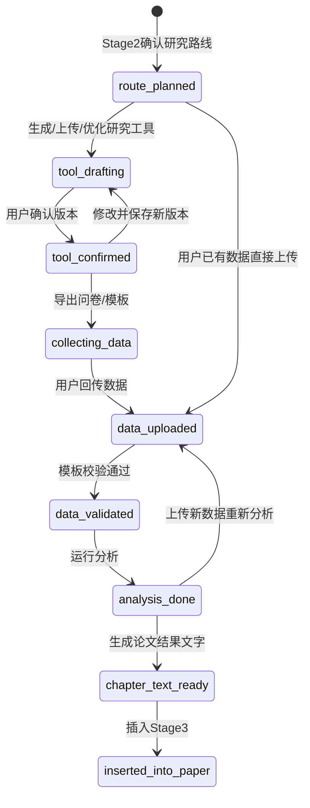
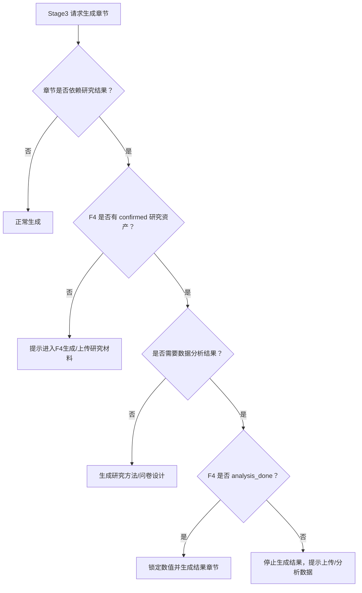
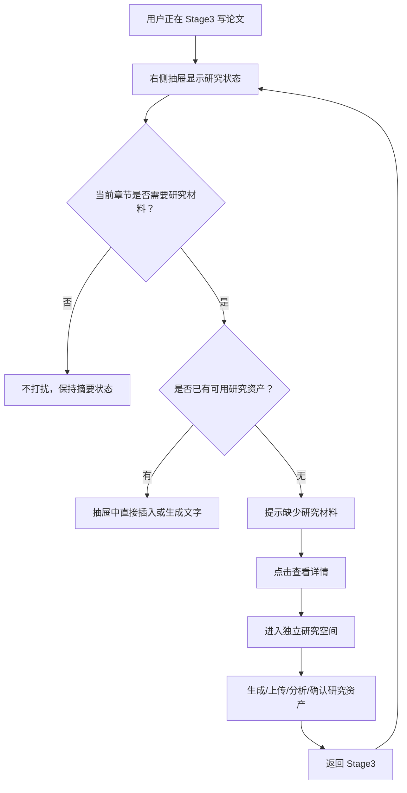

# F4 研究任务系统 PRD

> 文档状态：重构版 PRD 草案  
> 日期：2026-06-12  
> 核心结论：F4 不再定义为一个独立“研究计算页面”，而是论文项目中的研究任务系统。它负责记录、等待、生成、分析和回填研究材料；Stage3 负责把这些研究结果转成论文表达。

## 1. 重新定位

现有问题不是 KANO、量表或统计分析单个工具不够强，而是系统没有形成研究上下文闭环：

- Stage1 收集了资料，但后续模块没有稳定继承。
- Stage2 生成了大纲，但没有把“这篇论文需要做什么研究”沉淀成任务。
- F4 被做成孤立页面，像工具箱，不像论文项目的研究工作台。
- Stage3 生成正文时不知道研究任务处于什么状态，容易提前写、乱写或编造数据。

新的定位：

```text
Stage1：统一论文理解模型
Stage2：确认论文结构与研究路线
F4：研究任务系统，负责研究工具、数据、分析和留痕
Stage3：论文表达中心，负责插入、续写、润色和整合
```

F4 的核心价值不是“生成一个问卷”，而是管理论文从研究设计到数据分析再到正文回填的全过程。

## 2. 产品原则

1. **资料一次进入，全链路复用**  
   Stage1 已经输入的题目、背景材料、参考论文、已有正文、研究对象、核心论点，后续不应让用户反复描述。

2. **研究路线前置确认**  
   Stage2 大纲不是纯目录，而是对“这篇论文怎么研究”的确认。量化、质性、KANO、AHP、案例分析等路线会影响大纲结构和后续研究任务。

3. **研究计算需要等待状态**  
   用户生成问卷后，可能几天后才回收数据。系统必须知道当前论文卡在“等待收集数据”“待上传数据”“待分析”“待回填正文”等状态。

4. **F4 留痕，Stage3 表达**  
   F4 保存问卷版本、数据集、分析结果、编码结果和生成记录；Stage3 调用这些资产写成论文段落。

5. **不能编造未完成研究结果**  
   没有上传数据时，Stage3 可以写研究设计和问卷说明，不能写信度、效度、回归、中介、KANO 结论。

6. **每篇论文都有独立研究空间**  
   同一个课题可以随时重新生成问卷、上传新数据、追加分析、保存版本，并保留历史记录。

## 3. 总体流程图



## 4. Stage 分工

| 阶段 | 主要职责 | 产物 | 不该做的事 |
| --- | --- | --- | --- |
| Stage1 | 收集资料，建立统一理解模型 | 研究对象、写作边界、核心论点、学段建议、研究路线候选 | 不直接生成问卷或统计结论 |
| Stage2 | 确认大纲和研究路线 | 论文结构、研究方法章节、F4 任务清单 | 不把研究计算藏在普通大纲里 |
| F4 | 生成/优化研究工具，等待数据，分析数据，留痕 | 问卷版本、数据集、分析结果、编码结果、可插入文本 | 不负责最终语言风格润色 |
| Stage3 | 根据全文语境和风格档案写作表达 | 正文章节、摘要、结论、润色版本 | 不编造未完成的研究结果 |

## 5. 研究任务系统的信息架构

F4 应按“任务”组织，而不是按“按钮”组织。

```text
研究计算空间
├─ 当前论文上下文
│  ├─ Stage1 理解
│  ├─ Stage2 大纲与研究路线
│  ├─ Stage3 已写正文
│  └─ 用户上传材料
│
├─ 研究任务
│  ├─ 生成问卷/量表
│  ├─ 优化已有问卷
│  ├─ 上传数据并分析
│  ├─ KANO 分析
│  ├─ AHP 分析
│  ├─ 访谈/扎根/编码
│  └─ 生成第四章文字
│
├─ 研究资产
│  ├─ 问卷版本 v1/v2/v3
│  ├─ 数据表
│  ├─ 分析结果
│  ├─ 图表
│  └─ 可插入论文的文字块
│
└─ 回填 Stage3
   ├─ 插入研究方法
   ├─ 插入问卷设计
   ├─ 插入数据分析
   └─ 插入讨论/结论
```

## 6. 用户进入 F4 的三种目的

### 6.1 基于现有论文生成研究工具

用户已经完成 Stage1/Stage2，或者 Stage3 已有部分正文。系统根据论文上下文生成：

- 李克特量表
- 问卷正文
- KANO 问卷
- AHP 专家评分表
- 访谈提纲
- 扎根编码表
- 情感编码表

如果用户不满意，可以继续交互修改、重新生成、保存新版本。每次生成和确认都进入研究资产记录。

### 6.2 用户已有数据，直接分析

用户不需要系统生成问卷，已经有：

- 问卷回收 Excel/CSV
- KANO 回收数据
- AHP 专家评分表
- 访谈文本
- 评论文本
- 案例材料

系统应先识别数据类型，提示是否匹配模板，然后运行对应分析，再把结果回填 Stage3。

### 6.3 用户已有问卷，需要优化

用户上传或粘贴已有问卷，系统执行：

- 重复题检查
- 引导性问题检查
- 维度覆盖检查
- 题项表达优化
- 是否适合信效度分析判断
- 生成优化版问卷

优化版也作为研究资产保存，可继续导出、收集数据、上传分析。

## 7. 研究任务状态机



| 状态 | 含义 | Stage3 可以做什么 |
| --- | --- | --- |
| `route_planned` | 已确认研究路线 | 可写研究思路，不写具体问卷和结果 |
| `tool_drafting` | 正在生成或编辑研究工具 | 不自动写入正文 |
| `tool_confirmed` | 已确认正式问卷/量表/提纲 | 可写研究方法、变量测量、问卷设计 |
| `collecting_data` | 用户在外部收集数据 | 可写数据收集计划，不能写统计结论 |
| `data_uploaded` | 已上传数据，待校验 | 可提示等待分析，不写结果 |
| `data_validated` | 数据校验通过，待计算 | 可写样本来源，不写分析结论 |
| `analysis_done` | 分析完成 | 可生成第四章结果 |
| `chapter_text_ready` | F4 已生成论文文字 | 可插入 Stage3 |
| `inserted_into_paper` | 已写入正文 | 可继续润色、更新、同步版本 |

## 8. 研究资产模型

```ts
type ResearchAssetType =
  | 'research_plan'
  | 'scale_schema'
  | 'survey_questionnaire'
  | 'questionnaire_review'
  | 'kano_questionnaire'
  | 'ahp_expert_form'
  | 'interview_guide'
  | 'coding_scheme'
  | 'dataset'
  | 'analysis_result'
  | 'chart'
  | 'chapter_text'

interface ResearchAsset {
  id: string
  projectId: string
  taskId: string
  type: ResearchAssetType
  title: string
  version: number
  status: 'draft' | 'confirmed' | 'archived' | 'used_in_paper'
  source:
    | 'stage1_context'
    | 'stage2_outline'
    | 'stage3_text'
    | 'uploaded_by_user'
    | 'manual_edit'
    | 'analysis_generated'
  basedOnAssetIds: string[]
  structuredData: unknown
  plainText: string
  linkedSectionIds: string[]
  createdAt: number
  updatedAt: number
}
```

关键规则：

- `draft` 不自动进入 Stage3 上下文。
- `confirmed` 才能作为论文生成依据。
- `used_in_paper` 记录已经写入哪些章节。
- 已用于数据收集的问卷不应直接覆盖，应保存新版本。
- 已上传数据后，题项编号和变量结构应锁定，除非创建新研究任务。

## 9. 上下文联动规则

### 9.1 Stage1 到后续模块

Stage1 输出的不只是聊天摘要，而是稳定的项目上下文：

```text
论文题目
研究对象
写作边界
核心论点
研究路线候选
数据需求
可能使用的研究工具
不确定项
```

后续所有模块默认继承这些信息。

### 9.2 Stage2 到 F4

Stage2 确认大纲后，系统根据大纲生成 F4 任务清单。

Stage2 不强制用户必须确认唯一研究路线。允许出现 `暂不确定` 状态，但系统需要做兜底：

- 大纲仍可继续生成，但方法章节应保持弹性表达。
- F4 不自动创建强约束任务，只创建“待确认研究路线”任务。
- Stage3 写到研究方法、数据分析、问卷设计等章节时，需要再次提示用户确认路线。
- 如果用户上传已有数据或问卷，系统可根据材料反推研究路线，并更新研究任务。

```text
研究路线：暂不确定
兜底任务：
- 根据大纲识别可能研究路线
- 等待用户选择量化 / 质性 / 设计评价 / 案例分析
- 如用户上传数据或问卷，则根据材料反向创建研究任务
```

示例：

```text
研究路线：设计评价 / KANO
已创建任务：
- 生成 KANO 问卷
- 等待用户收集普通读者数据
- 上传 KANO 回收数据
- 输出需求属性分类和 Better-Worse 系数
- 生成第四章 KANO 分析文字
```

### 9.3 F4 到 Stage3

Stage3 写作时，根据章节类型读取不同资产：

| Stage3 章节类型 | 注入 F4 资产 |
| --- | --- |
| 研究方法 | 研究路线、问卷、量表、访谈提纲、抽样方案 |
| 变量测量 | 量表结构、变量定义、题项、计分规则 |
| 数据分析 | 数据集、统计结果、KANO/AHP/编码结果 |
| 讨论 | 假设验证、关键发现、优先级排序 |
| 结论 | 研究发现、贡献、不足和未来研究 |

如果任务还在 `collecting_data`，Stage3 必须提示：

```text
当前研究任务正在等待数据回收。可以生成研究方法和问卷设计，但不能生成统计结果。
```

## 10. 大模型等待机制

论文写作系统不能假装所有步骤已经完成。大模型需要知道何时停下。



典型等待文案：

```text
这部分需要问卷回收数据才能继续。当前系统已有问卷 v2，但尚未上传回收数据。
你可以先：
1. 导出问卷继续收集数据
2. 上传已有数据
3. 暂时跳过第四章结果，只生成前文
```

## 11. F4 任务类型设计

### 11.1 生成研究工具

输入：

- 自动带入 Stage1/Stage2/Stage3 上下文。
- 用户可补充研究对象、调研对象、用途、输出格式。
- 系统第一版内置默认 Prompt 模板，覆盖量表、KANO、AHP、访谈、编码和问卷优化；后续再开放甲方 Prompt 配置。

输出：

- 问卷/量表/KANO/AHP/访谈/编码方案。
- 版本记录。
- 导出文件。
- 数据模板。
- 优先输出“问卷星可粘贴格式”，其次再提供 TXT/CSV/Word 等通用格式。

第一版内置 Prompt 原则：

- 量表生成：从论文主题、变量关系和已写正文中抽取变量、维度、题项，不凭空发明无关变量。
- KANO 生成：必须围绕具体功能项、设计触点或需求项，不把抽象变量当功能项。
- AHP 生成：必须输出目标层、准则层、指标层和专家评分说明。
- 问卷优化：必须指出问题位置、问题类型、修改理由和优化版本。
- 质性编码：必须保留原文片段、编码依据和频次统计，不能只给抽象总结。

### 11.2 上传已有数据并分析

输入：

- Excel/CSV/TXT/DOCX/PDF。
- 用户选择或系统识别数据类型。

输出：

- 校验报告。
- 统计/编码/评价结果。
- 图表。
- 可写入论文的分析文字。

第一版目标不只做描述性统计，而是尽量覆盖合同里的常见分析链路：

- 样本统计。
- 描述性统计。
- 信度分析。
- 效度分析。
- Pearson 相关分析。
- 差异分析：T 检验 / ANOVA。
- 回归分析。
- 单中介效应分析。
- KANO 属性分类、Better-Worse 系数和优先级。
- AHP 权重和一致性检验。

实现上可以分层交付：基础统计和 KANO/AHP 先实现确定性计算；EFA、中介 Bootstrap 等复杂统计如果前端实现风险较高，可由后端或 Python 服务承接，但产品设计上不把它们排除在第一版流程之外。

### 11.3 优化已有问卷

输入：

- 用户已有问卷。
- 当前论文上下文。

输出：

- 检查报告。
- 问题列表。
- 优化建议。
- 优化版问卷。
- 是否适合后续信效度分析判断。

## 12. F4 与 Stage3 的推荐 UI 关系

优先采用 Stage3 右侧抽屉作为第一入口；如果任务复杂、空间不够，再点击“查看详情”进入独立研究空间。

```text
Stage3 右侧研究抽屉
  -> 快速查看当前研究状态
  -> 查看已确认问卷/量表
  -> 上传数据
  -> 插入当前章节
  -> 点击“详情”进入独立研究空间
```

独立研究空间仍然保留，但定位为深度工作台：

- 管理多个问卷/量表版本。
- 查看每次生成和修改记录。
- 上传大文件或多份数据。
- 运行完整统计分析。
- 对比多个分析版本。

推荐 UI：

```text
Stage3 主编辑器
├─ 左侧：章节与聊天
├─ 中间：正文
└─ 右侧：研究任务侧栏
   ├─ 当前研究状态
   ├─ 已确认问卷/量表
   ├─ 待上传数据
   ├─ 已完成分析
   └─ 插入当前章节
```

### 12.1 Stage3 右侧抽屉职责

Stage3 抽屉是写作过程中的研究助手，只处理轻操作、状态提醒和快速插入，不承载复杂研究编辑。

适合放在抽屉里的内容：

- 当前研究状态：
  - 未确认研究路线。
  - 已确认量表/问卷。
  - 等待数据回收。
  - 数据已上传待分析。
  - 分析完成可写入。
- 当前可用研究资产：
  - 已确认问卷。
  - 已确认量表。
  - KANO/AHP 研究工具。
  - 访谈提纲。
  - 分析结果。
  - 可写入论文的文字块。
- 当前章节可用动作：
  - 在研究方法章节插入问卷设计、变量测量、访谈设计。
  - 在第四章或数据分析章节插入样本统计、信效度、KANO 结果、编码结果。
  - 在讨论/结论章节插入主要发现和假设验证结论。
- 等待提示：
  - 没有确认量表时，不生成问卷设计。
  - 没有上传数据时，不生成统计结果。
  - 没有完成分析时，不写第四章结论。
- 快捷动作：
  - 插入当前章节。
  - 生成研究方法文字。
  - 上传数据。
  - 查看详情。

抽屉的产品定位：

```text
Stage3 抽屉 = 研究状态仪表盘 + 快捷调用器
```

### 12.2 独立研究空间职责

独立研究空间是完整研究工作台，用于复杂任务、版本管理、数据处理和完整分析。

适合放在独立研究空间里的内容：

- 研究路线确认和修改。
- 生成问卷、量表、KANO、AHP、访谈提纲。
- 上传已有问卷并优化。
- 上传数据表并校验。
- 运行完整统计分析。
- 查看分析表格和图表。
- 管理问卷/量表版本。
- 对比历史版本。
- 导出问卷星可粘贴格式。
- 导出 CSV/Word/TXT。
- 生成第四章完整结果文字。

独立研究空间的产品定位：

```text
独立研究空间 = 完整研究工作台
```

### 12.3 抽屉与独立空间的切换逻辑



切换规则：

- 抽屉能完成的，不强迫用户离开 Stage3。
- 涉及多版本编辑、数据校验、完整统计、图表查看、问卷优化的任务，进入独立研究空间。
- 独立空间完成任务后，回到 Stage3 抽屉继续插入正文。
- Stage3 抽屉始终显示当前研究任务的下一步，避免用户不知道卡在哪里。

## 13. MVP 建议

第一版的核心仍然是“研究任务闭环”，但统计分析能力不应只停留在描述性统计。MVP 应先把完整流程搭起来，并尽量实现合同中的常见分析能力；复杂统计可分技术层级实现，但产品入口和状态必须先预留。

1. Stage1 保存研究路线建议。
2. Stage2 可确认研究路线，也可选择暂不确定。
3. Stage2 确认大纲后创建 F4 任务；暂不确定时创建待确认任务。
4. F4 支持三类入口：
   - 根据论文生成研究工具
   - 上传已有数据/材料分析
   - 上传已有问卷优化
5. F4 研究工具支持版本留痕和确认。
6. F4 优先导出问卷星可粘贴格式，并支持数据模板。
7. F4 支持上传数据后运行模板校验和统计/设计评价/质性分析。
8. Stage3 右侧抽屉展示当前研究任务状态，并可进入独立详情页。
9. Stage3 生成研究方法时自动感知 confirmed 研究工具。
10. Stage3 生成结果章节时，如果没有分析结果则等待，不编造。
11. Stage3 可插入 F4 资产，并记录来源版本。

## 14. 研究历史与版本策略

F4 研究历史独立于 F7 论文版本历史，不与正文历史回溯合并。

版本策略：

- 每篇论文可以拥有多个研究任务。
- 每个研究任务可以拥有多个问卷/量表/分析版本。
- 一篇文章允许保留约 10 个量表或问卷版本，便于用户对比和回退。
- 研究资产按类型分组：问卷版本、数据集、分析结果、可写入文本。
- 已经用于论文正文的资产标记为 `used_in_paper`，并记录关联章节。
- 删除或归档研究资产不应影响已经写入正文的内容，但需要保留来源提示。

## 15. 已确认产品决策

| 问题 | 决策 |
| --- | --- |
| F4 入口形态 | 先做 Stage3 右侧抽屉；不够用时点击详情进入独立研究空间 |
| Stage2 研究路线 | 允许暂不确定，后续由 F4/Stage3 兜底确认 |
| Prompt 来源 | 第一版系统内置默认 Prompt，先跑通体验；后续再支持甲方配置 |
| 外部平台未接入时的导出 | 优先问卷星可粘贴格式，再考虑 TXT/CSV/Word |
| 数据分析范围 | 产品上按完整常见分析链路设计，不只做描述性统计；技术上可分层实现 |
| 历史版本 | F4 独立留痕，不合并 F7；一篇文章可保留多个量表/问卷版本 |

## 16. 后续待定问题

1. Stage3 抽屉中哪些动作可以直接完成，哪些必须进入独立详情页？
2. “暂不确定”路线下，Stage3 写到研究方法时的兜底提示应该多强？
3. 问卷星可粘贴格式需要覆盖哪些题型：单选、矩阵单选、KANO 正反向组、基本信息题？
4. 统计分析第一版采用纯前端、Node 后端，还是 Python 服务？
5. 一篇文章保留 10 个量表版本时，是否需要手动归档和版本命名？

## 17. 一句话产品定义

F4 是论文项目的研究任务系统：它接住 Stage1 和 Stage2 已确认的研究意图，在论文写作过程中生成、保存、等待、分析和回填研究材料，让 Stage3 在正确的研究状态下完成论文表达。
